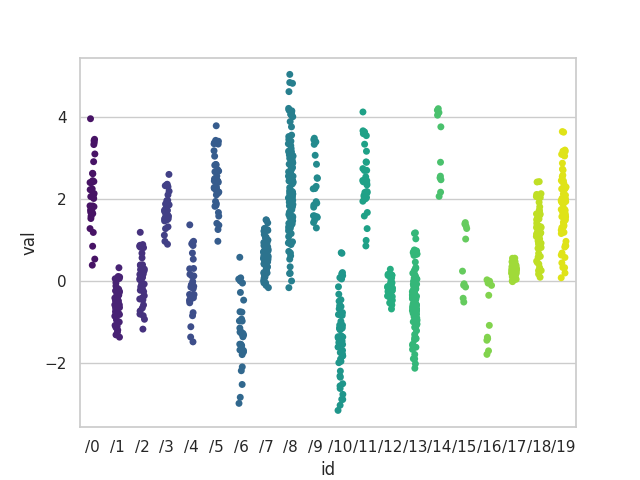
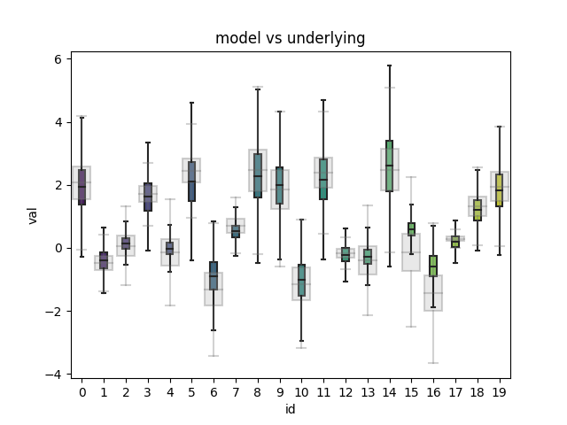
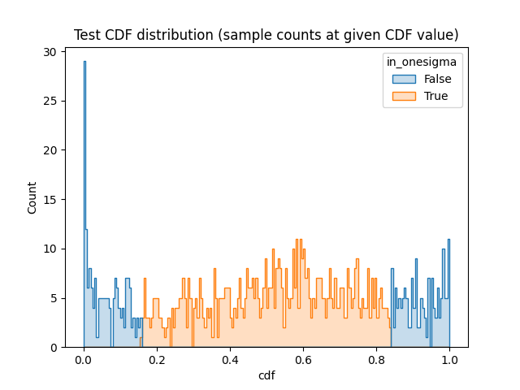

# ML variance

This repository investigates neural nets ability to produce variance estimates around the predictions using uncertainty estimate techniques.

We are therefore looking to answer the following question:

> How certain can we be about any particular prediction?

This question is also related to neural net ability to model conditional distributions.

## Methodology

1. Create synthetic dataset:
   1. Create R normally distributed data sources ("resources") identified by an "id". Each resource has its own mean, variance and quantity of available samples. These distributions are referred to as "underlying".
   2. Means and variances are drawn randomly from flat range
   3. Quantity is drawn from gamma distribution (default is set to be exponential)
   4. Sample the R resources to produce N values ("val")
   5. Create training, validation and test datasets that contain id to val mappings (X=id, y=val)
2. Train dropout-based neural net on the datasets (without showing it the underlying distributions)
3. Create mean + variance predictions using Monte Carlo Dropout method (repeated predictions with dropout enabled during inference)
4. Compare and quantify the means and variances predicted by the model with the underlying distributions

Measure of success is how well the model replicates original distributions.

## Experiments

* `base` - initial setup with 64 neurons, dropout set to 0.5, underlying distribution means between -3 and 3, standard deviations between 0.1 and 1.
* `high_dropout` - dropout factor increased to 0.9
* `low_dropout` - dropout factor decreased to 0.1
* `high_loc` - underlying mean increased to 10-13
* `high_scale` - standard deviations increased to 1-10
* `large_size` - increased dense layer size to 1024
* `small_size` - decreased dense layer size to 16

| Experiment             | generate.r_loc | generate.r_scale | train.dense_size | train.dense_dropout |
| ---------------------- | -------------- | ---------------- | ---------------- | ------------------- |
| [large_size]           | ['-2', '3']    | ['0.1', '1']     | 1024             | 0.5                 |
| [small_size]           | ['-3', '3']    | ['0.1', '1']     | 16               | 0.5                 |
| [low_dropout]          | ['-3', '3']    | ['0.1', '1']     | 64               | 0.1                 |
| [high_dropout]         | ['-3', '3']    | ['0.1', '1']     | 64               | 0.9                 |
| [high_scale]           | ['-3', '3']    | ['1', '10']      | 64               | 0.5                 |
| [high_loc]             | ['10', '13']   | ['0.1', '1']     | 64               | 0.5                 |
| [base]                 | ['-3', '3']    | ['0.1', '1']     | 64               | 0.5                 |
| [low_size_and_dropout] | ['-2', '3']    | ['0.1', '1']     | 64               | 0.5                 |

## Obtained metrics

| Experiment             | calibration | val_loss | underlying_loc_mse | underlying_scale_mse |
| ---------------------- | ----------- | -------- | ------------------ | -------------------- |
| [large_size]           | 3.2         | 0.33985  | 0.094252           | 0.053209             |
| [small_size]           | 1.5         | 0.54489  | 0.14639            | 0.048005             |
| [low_dropout]          | 4.2         | 0.37703  | 0.15521            | 0.057518             |
| [high_dropout]         | 1.4         | 1.0199   | 0.35793            | 0.11076              |
| [high_scale]           | 8.3         | 31.384   | 1.1987             | 4.8157               |
| [high_loc]             | 0.4         | 4.2039   | 0.056997           | 0.075054             |
| [base]                 | 1.9         | 0.4361   | 0.091593           | 0.054721             |
| [low_size_and_dropout] | 1.7         | 0.49914  | 0.13894            | 0.046715             |

## Graphs

### base

