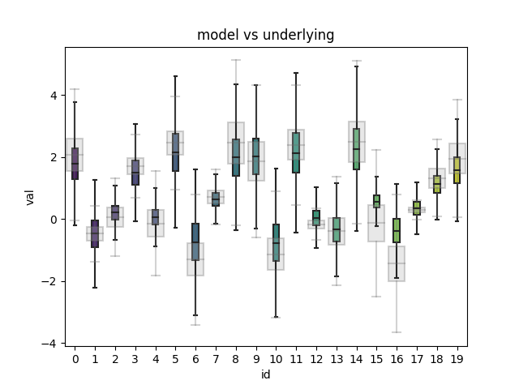

# ML variance

This repository investigates uncertainty estimation techniques for the purpose of producing variance predictions in a neural net regression setting. We seek to answer the following question:

> What is a typical range of estimates to expect from any particular input?

More information on this subject can be found for example in [Quantifying uncertainty in deep learning systems](https://docs.aws.amazon.com/prescriptive-guidance/latest/ml-quantifying-uncertainty/welcome.html)

The technique used here can be used to estimate both aleatory (inherent), as well as epistemic (model) randomness, but cannot distinguish between the two.

## Methodology

1. Create synthetic dataset:
   1. Create R normally distributed data sources ("resources") identified by an "id". Each resource has its own mean, variance and quantity of available samples. These distributions are referred to as "underlying".
   2. Means and variances are drawn randomly from a uniform distribution
   3. Quantity is drawn from a gamma distribution (default is set to be exponential)
   4. Sample the R resources to produce N values ("val"), where N>>R (each resource repeats many times, but with different values)
   5. Create training, validation and test datasets that contain id to val mappings (X=id, y=val)
2. Train dropout-based neural net on the datasets (without showing it the underlying distributions)
3. Create mean + variance predictions using Monte Carlo Dropout method (repeated predictions with dropout enabled during inference)
4. Compare and quantify the means and variances predicted by the model with the underlying distributions

Measure of success is how well the model replicates original distributions.

## Graphs walkthrough

The following graphs are produced - here, a base experiment is depicted. Graph results for remaining experiments are at the bottom.

### Training samples

First plot shows the training samples used to prepare the model. This also shows the quantity of samples drawn from each underlying distribution vary.


Note this plot is omitted for the rest of results because it looks similar. It can still be found in the "results" directory in this repo.

### Predicted vs underlying distributions

Second plot compares conditional distributions estimated by the model (in color) with the underlying distributions (in gray). The closer the match, the higher the degree of success.

Note at no point the model has seen the underlying distributions - these are estimated from available samples.


### Quality check

Third plot is for quality-control purposes: during the training, variance output is calibrated so that the variance estimate produced by the model matches the variance observed in the validation dataset (NOT underlying distributions, these remain hidden).

In other words, standard deviation values produced by the model get uniformly stretched or shrunk by a constant factor so they match validation set's standard deviation. In inference this factor remains constant regardless of input.

Validation samples captured by the calibration are depicted in orange on this histogram, and should be around 2/3rds of all samples.


## Technique for estimating variance

The method of estimating variance is based on dropout. During inference, dropout layer remains enabled:

```python
l = tf.keras.layers.Dropout(self.dense_dropout)(l, training=True)
```

As a result, only a subset of neurons is used to produce the prediction, giving responses that exhibit variance even if the input is held constant. To produce a single output we iterate the inference 30 times, which produces a distribution. From this we can estimate both the mean as well as variance.

There are alternative techniques for estimating variance with neural nets, which are unused here. One of them is using an ensemble of neural nets in a similar way to dropout. Another is architecting the network to produce variance explicitly as an output.

## Experiments

* `base` - initial setup with 64 neurons, dropout set to 0.5, underlying distribution means between -3 and 3, standard deviations between 0.1 and 1.
* `high_dropout` - dropout factor increased to 0.9
* `low_dropout` - dropout factor decreased to 0.1
* `high_loc` - underlying mean increased to 10-13
* `high_scale` - standard deviations increased to 1-10
* `large_size` - increased dense layer size to 1024
* `small_size` - decreased dense layer size to 16

| Experiment             | generate.r_loc | generate.r_scale | train.dense_size | train.dense_dropout |
| ---------------------- | -------------- | ---------------- | ---------------- | ------------------- |
| [large_size]           | ['-3', '3']    | ['0.1', '1']     | 1024             | 0.5                 |
| [small_size]           | ['-3', '3']    | ['0.1', '1']     | 16               | 0.5                 |
| [low_dropout]          | ['-3', '3']    | ['0.1', '1']     | 64               | 0.1                 |
| [high_dropout]         | ['-3', '3']    | ['0.1', '1']     | 64               | 0.9                 |
| [high_scale]           | ['-3', '3']    | ['1', '10']      | 64               | 0.5                 |
| [high_loc]             | ['10', '13']   | ['0.1', '1']     | 64               | 0.5                 |
| [base]                 | ['-3', '3']    | ['0.1', '1']     | 64               | 0.5                 |
| [low_size_and_dropout] | ['-3', '3']    | ['0.1', '1']     | 64               | 0.5                 |


## Obtained metrics

The following metrics are provided:

* calibration: this number is just for quality control purposes and is otherwise largely arbitrary, but still interesting
* val_loss: validation loss of training
* underlying_loc_mse: MSE calculated on the difference between estimated mean and underlying mean (low is better)
* underlying_scale_mse: MSE calculated on the difference between estimated and underlying standard deviations (low is better)

| Experiment             | calibration | val_loss | underlying_loc_mse | underlying_scale_mse |
| ---------------------- | ----------- | -------- | ------------------ | -------------------- |
| [large_size]           | 3.2         | 0.33985  | 0.094252           | 0.053209             |
| [small_size]           | 1.5         | 0.54489  | 0.14639            | 0.048005             |
| [low_dropout]          | 4.2         | 0.37703  | 0.15521            | 0.057518             |
| [high_dropout]         | 1.4         | 1.0199   | 0.35793            | 0.11076              |
| [high_scale]           | 8.3         | 31.384   | 1.1987             | 4.8157               |
| [high_loc]             | 0.4         | 4.2039   | 0.056997           | 0.075054             |
| [base]                 | 1.9         | 0.4361   | 0.091593           | 0.054721             |
| [low_size_and_dropout] | 1.7         | 0.49914  | 0.13894            | 0.046715             |

## Graphs

### base

Base graphs are included above in "Graphs walkthrough"

### large_size


### small_size




### low_dropout


### high_dropout


### high_scale


### high_loc


